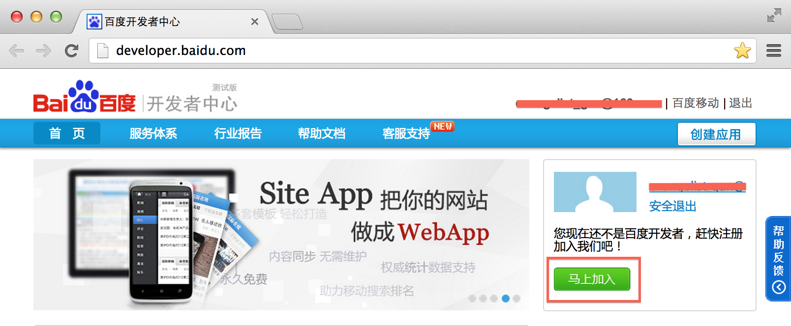
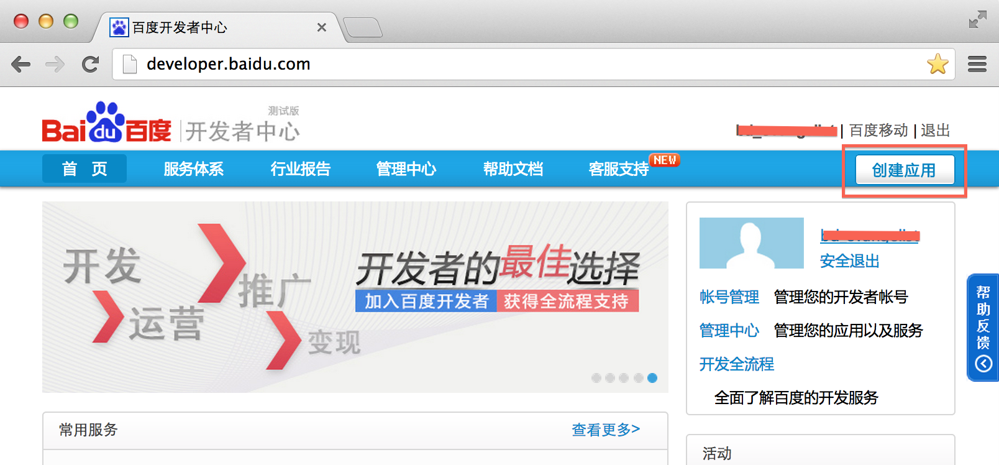
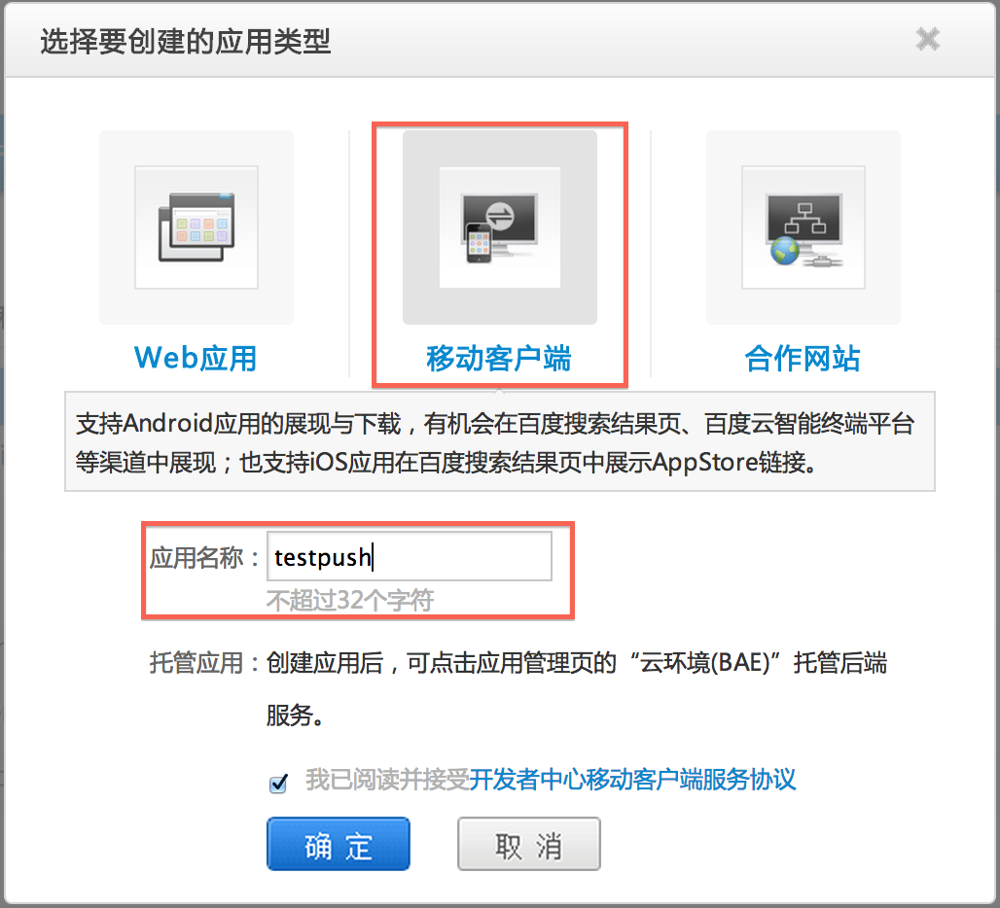
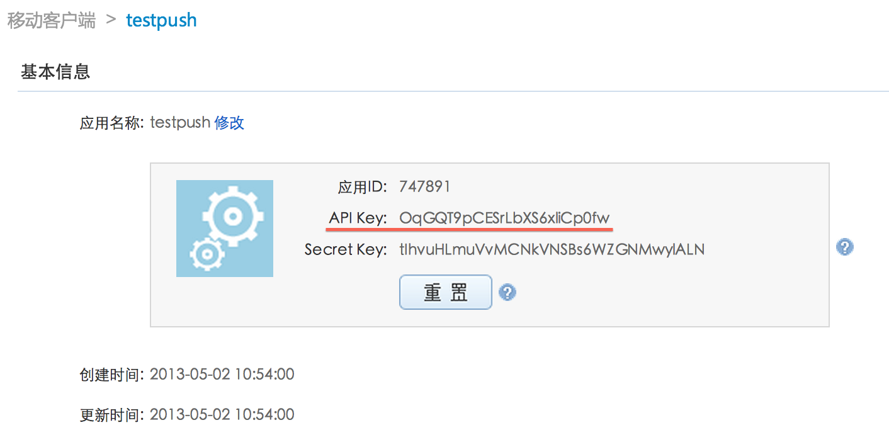
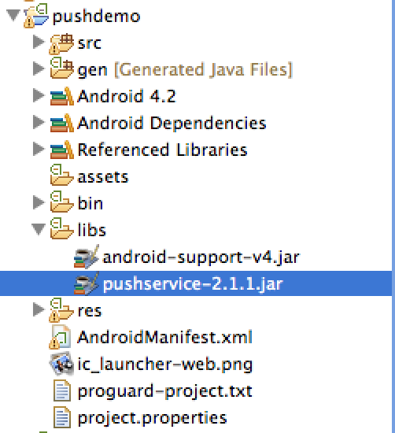
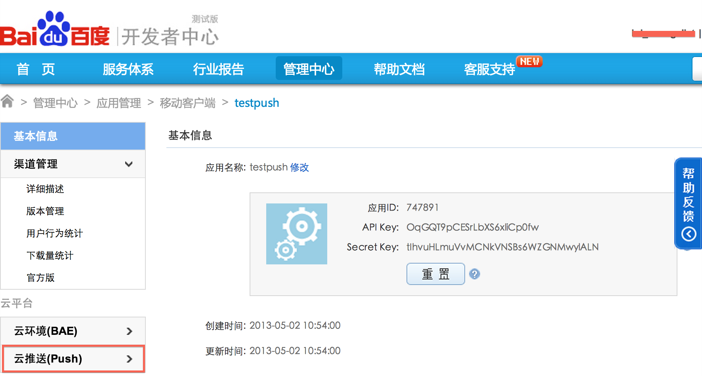
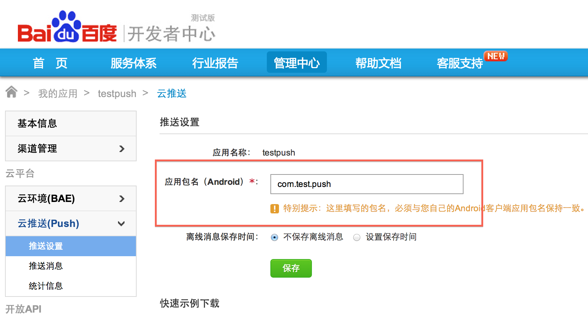
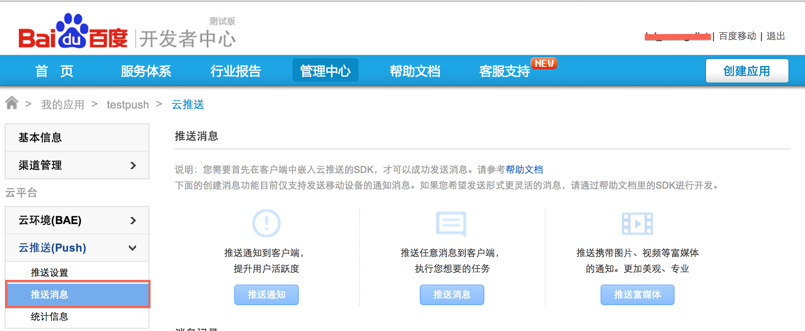

# 百度云推送（Push）使用基础篇

现在推送服务已经成为了一个应用的刚需，像“新版本提示”、“新活动提示”、“消息提醒”等功能基本上都是使用Push来实现，但是Push在大部分应用中并不能充当主营的业务，往往作为丰富应用功能，方便云端向客服端推送实时消息的角色。本人觉得这类服务应该足够简单，让开发者花很小的代价的使用这类服务，并能够很快的集成到自己的应用中，在这里为大家推荐一个Push服务-----百度云推送（Push）。

百度云推送（push）是百度云平台向开发者提供的消息推送服务；通过利用云端与客户端之间建立稳定、可靠的长连接来为开发者提供向客户端应用推送实时消息服务。

本人通过自身的实践，很快将百度云服务（Push）集成到自己的App中，现将集成步骤分享给大家。

## 前期准备

百度云服务（Push）提供两种初始化的方法，分别是：

* 无账号初始化

	当你有自己的账号系统时，可以使用无账号初始化Push

	
* 百度帐号初始化

	当你没有帐号系统时，可以使用百度帐号来初始化Push服务
	
	
这两种方法都需要以API Key（百度开发者创建的应用程序的唯一标识）作为参数，所以我们首先需要成为百度开发者并创建应用获取API Key，步骤如下：

（1）登陆 [百度开发者中心](http://developer.baidu.com)，如果不是百度开发者，需要先注册成为百度开发者，如果已经是百度开发者请直接到步骤（2）

（2）点击 [“创建应用”](http://developer.baidu.com/dev#/create)

（3）选择“移动客服端”，并输入“应用名称”，点击“确定”

（4）获取API Key

## 开发

（1）添加pushservice.jar到工程中libs目录下，并将该jar包添加到工程的Java Build Path

	

（2）修改AndroidManifest.xml
 
 * 声明运行Push的权限
 
 	    <!-- Push service 运行需要的权限 -->
    	<uses-permission android:name="android.permission.INTERNET" />
    	<uses-permission android:name="android.permission.READ_PHONE_STATE" />
    	<uses-permission android:name="android.permission.ACCESS_NETWORK_STATE" />
    	<uses-permission android:name="android.permission.RECEIVE_BOOT_COMPLETED" />
    	<uses-permission android:name="android.permission.BROADCAST_STICKY" />
    	<uses-permission android:name="android.permission.WRITE_SETTINGS" />
    	<uses-permission android:name="android.permission.VIBRATE" />

    	<!-- for log. -->
    	<uses-permission android:name="android.permission.WRITE_EXTERNAL_STORAGE" />
    	<uses-permission android:name="android.permission.ACCESS_DOWNLOAD_MANAGER" />
    	<uses-permission android:name="android.permission.DOWNLOAD_WITHOUT_NOTIFICATION" />
    	<uses-permission android:name="android.permission.SYSTEM_ALERT_WINDOW" />
    	<uses-permission android:name="android.permission.DISABLE_KEYGUARD" />
    	<uses-permission android:name="android.permission.ACCESS_COARSE_LOCATION" />
    	<uses-permission android:name="android.permission.ACCESS_WIFI_STATE" />
    	<uses-permission android:name="android.permission.ACCESS_FINE_LOCATION" />
    	
  * 注册消息接收receiver
   	
   		<receiver android:name="com.baidu.pushdemo.PushMessageReceiver" > 	
            <intent-filter>
                <!-- 接收push消息 -->
                <action android:name="com.baidu.android.pushservice.action.MESSAGE" />
                <!-- 接收bind,unbind,fetch,delete等反馈消息 -->
                <action android:name="com.baidu.android.pushservice.action.RECEIVE" />
                <action android:name="com.baidu.android.pushservice.action.notification.CLICK" />
            </intent-filter>
        </receiver>

 * 添加Push服务端配置
 	
        <!-- push service -->
        <receiver
            android:name="com.baidu.android.pushservice.PushServiceReceiver"
            android:process=":bdservice_v1" >
            <intent-filter>
                <action android:name="android.intent.action.BOOT_COMPLETED" />
                <action android:name="android.net.conn.CONNECTIVITY_CHANGE" />
                <action android:name="com.baidu.android.pushservice.action.notification.SHOW" />
                <action android:name="com.baidu.android.pushservice.action.media.CLICK" />
            </intent-filter>
        </receiver>
        <receiver
            android:name="com.baidu.android.pushservice.RegistratonReceiver"
            android:process=":bdservice_v1" >
            <intent-filter>
                <action android:name="com.baidu.android.pushservice.action.METHOD" />
                <action android:name="com.baidu.android.pushservice.action.BIND_SYNC" />
            </intent-filter>
            <intent-filter>
                <action android:name="android.intent.action.PACKAGE_REMOVED" />

                <data android:scheme="package" />
            </intent-filter>
        </receiver>

        <service
            android:name="com.baidu.android.pushservice.PushService"
            android:exported="true"
            android:process=":bdservice_v1" />

        <!-- push service end -->
        
* 添加富媒体显示的Activity
 	
        <!-- push service rich media display -->
        <activity
            android:name="com.baidu.android.pushservice.richmedia.MediaViewActivity"
            android:configChanges="orientation|keyboardHidden"
            android:label="MediaViewActivity" >
        </activity>
        <activity
            android:name="com.baidu.android.pushservice.richmedia.MediaListActivity"
            android:configChanges="orientation|keyboardHidden"
            android:label="MediaListActivity"
            android:launchMode="singleTask" >
        </activity>
        
（3）在工程src/下编写“PushMessageReceiver.java”文件，完成push消息接收和处理功能

	public class PushMessageReceiver extends BroadcastReceiver {

		@Override
		public void onReceive(final Context context, Intent intent) {

			if (intent.getAction().equals(PushConstants.ACTION_MESSAGE)) {
				//获取Push消息内容
				String message = intent.getExtras().getString(
					PushConstants.EXTRA_PUSH_MESSAGE_STRING);
			
			} else if (intent.getAction().equals(PushConstants.ACTION_RECEIVE)) {
			
				//处理bind等方法的返回数据
				//注:PushManager.startWork()的返回值通过PushConstants.METHOD_BIND得到
			
				//获取调用的方法
				final String method = intent.getStringExtra(PushConstants.EXTRA_METHOD);
			
				//方法返回错误码,您需要恰当处理。比如，方法为bind时，若失败，需要重新bind,即重新调用startWork
				final int errorCode = intent.getIntExtra(PushConstants.EXTRA_ERROR_CODE,PushConstants.ERROR_SUCCESS);
			
				//返回Push消息的内容
				final String content = new String(intent.getByteArrayExtra(PushConstants.EXTRA_CONTENT));
			
				Toast.makeText(context,
					"method : " + method + "\n result: " + errorCode
							+ "\n content = " + content, Toast.LENGTH_SHORT).show();
				
			} else if (intent.getAction().equals(PushConstants.ACTION_RECEIVER_NOTIFICATION_CLICK)) {
				//用户点击通知后的处理
				Intent aIntent = new Intent();
				aIntent.addFlags(Intent.FLAG_ACTIVITY_NEW_TASK);
				
				//当用户点击通知后启动显示信息的Activity
				aIntent.setClass(context, DisplayMessage.class);
			
				//Push信息的title
				String title = intent.getStringExtra(PushConstants.EXTRA_NOTIFICATION_TITLE);
				aIntent.putExtra(PushConstants.EXTRA_NOTIFICATION_TITLE, title);
			
				//Push信息的content
				String content = intent.getStringExtra(PushConstants.EXTRA_NOTIFICATION_CONTENT);
				aIntent.putExtra(PushConstants.EXTRA_NOTIFICATION_CONTENT, content);

				context.startActivity(aIntent);
			}
		}

	}
	
（4）添加一个用户点击通知信息后的响应Activity，本实例中是显示Push信息的Activity，名为“DisplayMessage.java”

	@Override
	protected void onCreate(Bundle savedInstanceState) {
		super.onCreate(savedInstanceState);
		setContentView(R.layout.display_message);
		
		message_title = (TextView)findViewById(R.id.message_tile);
		message_content = (TextView)findViewById(R.id.message_content);
		
		//获取push消息的title和content
		Intent intent = getIntent();
		//获取信息的title
        String title = intent.getStringExtra(PushConstants.EXTRA_NOTIFICATION_TITLE);
        //获取信息的content
        String content = intent.getStringExtra(PushConstants.EXTRA_NOTIFICATION_CONTENT);
        
        //显示信息的title和content
        message_title.setText(title);
        message_content.setText(content);
        
	}
	
（5）在需要启动Push服务的Activity中调用PushManager.startWork()启动Push服务，本实例通过点击button启动Push服务

	public class MainActivity extends Activity {
	
		private Button ak_init;
	
		//开发者中心获取的API Key
		private static final String API_KEY = "";

		@Override
		protected void onCreate(Bundle savedInstanceState) {
			super.onCreate(savedInstanceState);
			setContentView(R.layout.activity_main);
		
			ak_init = (Button)findViewById(R.id.ak_init);
		
			ak_init.setOnClickListener(new Button.OnClickListener(){

				@Override
				public void onClick(View v) {
					// TODO Auto-generated method stub			
				   // startWork()完成Push服务的初始化，并且完成自动bind工作				
					PushManager.startWork(getApplicationContext(),
					                      PushConstants.LOGIN_TYPE_API_KEY, API_KEY);
				}
						
			});
		}

	}
	
到此，客户端上的Push就已经完成了。

## 推送后台

客户端已经开发完成，那么服务器端需要把信息推送到客户端的话就需要开发服务端，而百度云推送帮我们解决了开发服务器端的问题，在百度开发者中心上直接提供推送后台，使推送更为简单，下面介绍如何使用Push推送后台。

（1）回到刚刚创建完成的页面，点击“云推送(Push)”

	
（2）填写创建的Android工程的包名后点击“保存”

（3）点击“推送消息”，根据实际的情况选择推送类型

## 注意

如果我们推送的是“富媒体”类型的消息的话，那么需要在Android工程中加入显示富媒体消息的样式，步骤如下：

（1）将下面三个文件放在/res/layout/下

（2）将下面的图片放在/res/drawable-hdpi/下